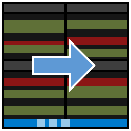

# VS Code as Git Mergetool

This extension provides diff editor layouts for 3-way merges
directly in VS Code.

[Demo screencast](media/demo.mp4)

> Do you have a minute? You could help by upvoting needed API features.
> See [Contribute](#Contribute).

## Features

- Assists in setting up suitable Git and VS Code configuration options,
  which allows that VS Code is invoked
  when an external `git mergetool` is executed.
- Shows a 3- or 4-pane diff layout when VS Code opens a merge situation.
  These layouts can be switched during merging.
  There is an additional mechanism called “zooming”,
  allowing to quickly change layout proportions using keyboard shortcuts.
- Synchronizes the scroll and cursor position of the editors
  according to a text diff.
- Provides commands for launching/continuing/stopping `git mergetool`,
  as well as a super command guiding through the whole merge process
  by invoking other commands as appropriate (by default `shift+alt+m` `m`).
- Adds key bindings for commands most useful during merge (`shift+alt+m` …).
  See the contributions tab in VS Code or
  the `keybindings` section in [`package.json`](package.json).
- Optionally opens the Git commit message in an editor
  after a successful `git mergetool` execution
  (as a workaround for few Git extension bugs).
- Allows to select arbitrary files for merging,
  invoking `git merge-files` and the diff layout.
- Provides a command for `git merge --abort` and `git merge --quit`.

At time of release this has been tested only on my Linux machine,
so especially Windows and MacOS users are welcomed
to report any compatibility issues. See [Contribute](#Contribute).

## Installation

This is extension is available
[in the official Marketplace](https://marketplace.visualstudio.com/items?itemName=zawys.vscode-as-git-mergetool).

> Launch VS Code Quick Open (Ctrl+P), paste the following command, and press enter.
>
> `ext install zawys.vscode-as-git-mergetool`

Alternatively, you can get the build from GitHub:

- Go to the
  [latest Release](https://github.com/zawys/vscode-as-git-mergetool/releases/latest)
  and download the VSIX.
- Skip this if you do not want to verify the signature:
  - Download the other files into the same directory.
  - `sha256sum -c SHA256SUMS`
  - `gpg --recv-keys '4A5D 4A5F B953 7A3A B931 6463 41B3 FBF3 7F23 3754'`
  - `gpg --verify SHA256SUMS.sig SHA256SUMS`
- Run the command “Install from VSIX…” inside VS Code and select the VSIX.

## Usage

When you have a merge conflict in an opened repo,
you can run the command “Start `git mergetool`” from the command palette
or the command menu in the SCM panel.
Then the layout should change and new buttons in the status bar should appear.

When you start `git mergetool` from the command line,
that process is not controlled by the extension
but still a diff layout in VS Code should open.

## Layout

The default layout `4TransferRight` has 4 panes
showing the changes distributed over two dimensions:

- Top vs. bottom panes: local vs. remote changes
- Left vs. right panes: changes applied starting from base vs. ending in merged

In the right panes you can edit the (same) merged file
and the goal of the game is to make the right side
semantically equal the left side. 😅

There are also several other layouts available.

## Known issues

- When you have an file with conflicts opened,
  start a diff layout for that file and stop the diff layout,
  then it may happen that the originally opened editor is closed
  and a diff editor remains instead.
  This is due to a limitation of VS Code that editors seem to be recreated
  when previously covered by other editors and
  then there is no reliable way to find out who the editor belongs to.

  **TL;DR**: Use the command “Deactivate diff layout”,
  “Stop mergetool” or `Ctrl+W`
  to stop the diff editor layout.
  Auto save is useful, too.

## Contribute

Feel free to file feature requests and bug reports
[on GitHub](https://github.com/zawys/vscode-as-git-mergetool/issues).

👉 **You can help making new features for this extension possible
by adding your 👍 to following issues
([info](https://github.com/microsoft/vscode/wiki/Issues-Triaging#up-voting-a-feature-request)).**
But DO NOT post comments there
which provide no additional information or ideas.

- [#105625: API for reacting to and setting horizontal scroll position](https://github.com/microsoft/vscode/issues/105625):

  For synchronized horizontal scrolling.

- [#105487: Invoke initial command via process arguments](https://github.com/microsoft/vscode/issues/105487):

  For using the mergetool functionality
  via the command line independent from Git’s file naming convention.

## Build

1. [Install Yarn globally](https://classic.yarnpkg.com/en/docs/install)
2. `yarn`
3. `yarn run build`

   The generated VSIX should then be in `packages/`.

### Development environment setup

Run the steps listed in [section Build](#Build).

Additionally, see the
[VSC Extension Quickstart](vsc-extension-quickstart.md).

You probably also want to install
[VS Code Insiders](https://code.visualstudio.com/insiders/) to run the tests,
see [reason](https://code.visualstudio.com/api/working-with-extensions/testing-extension#using-insiders-version-for-extension-development).

## Further info

- [Change log](CHANGELOG.md)
